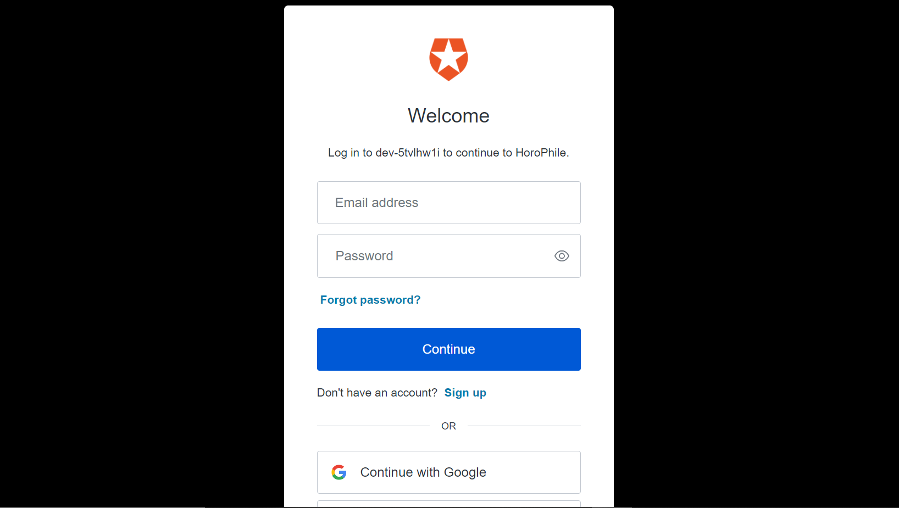
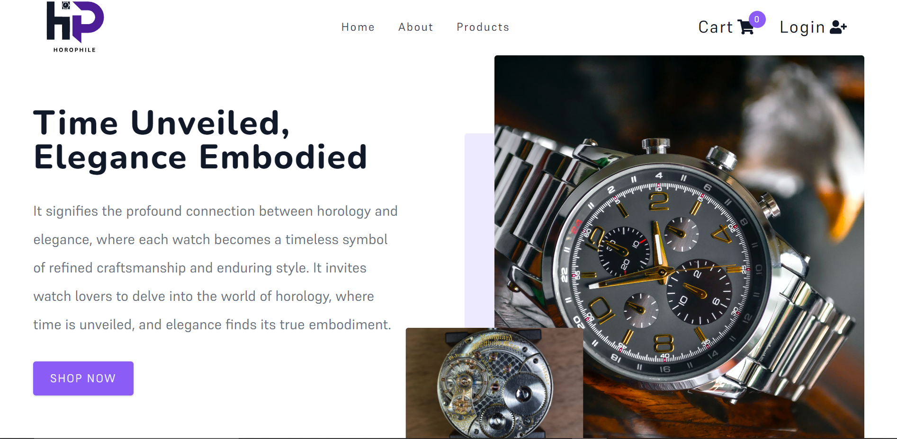
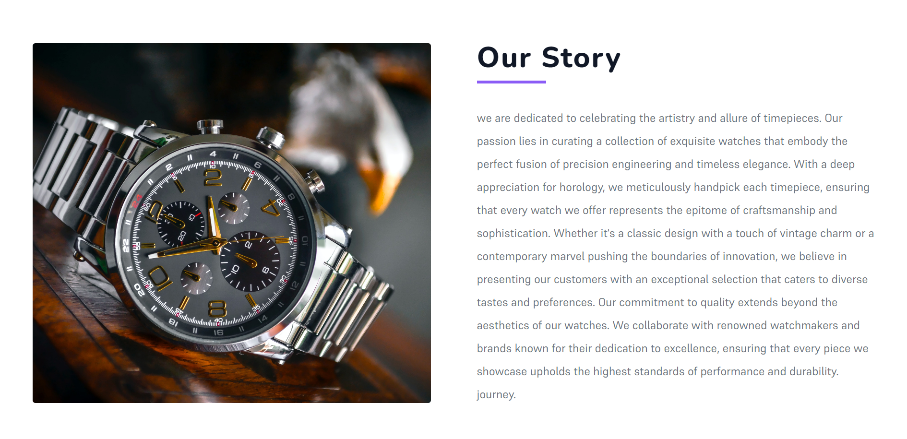
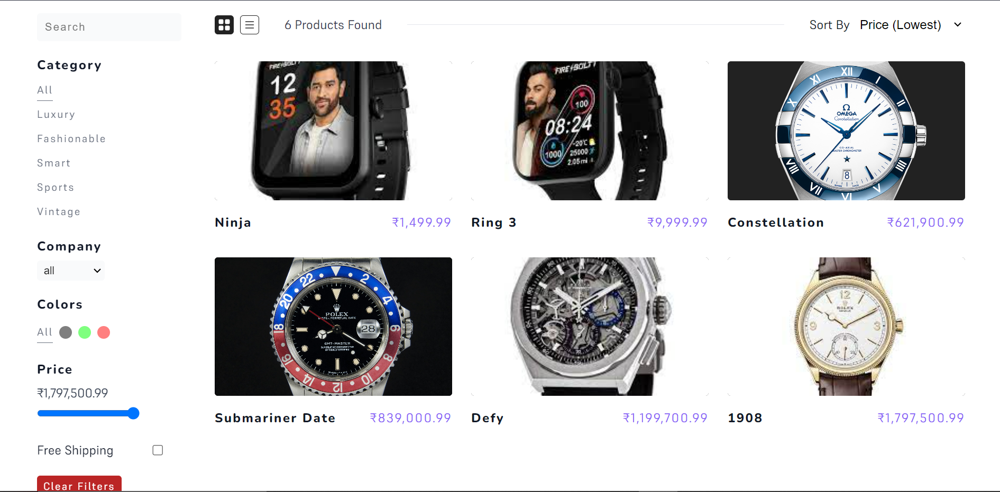
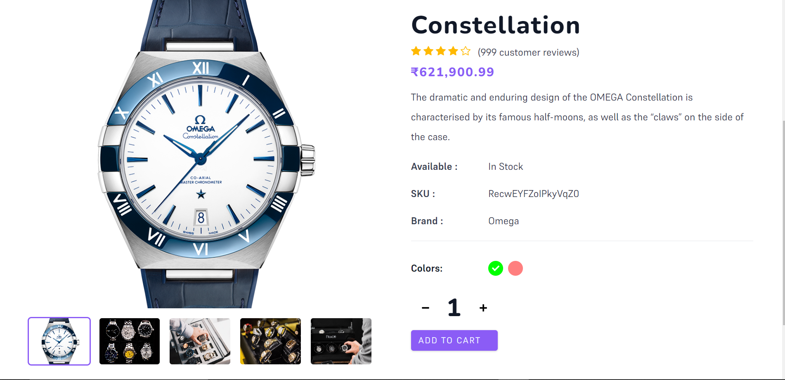
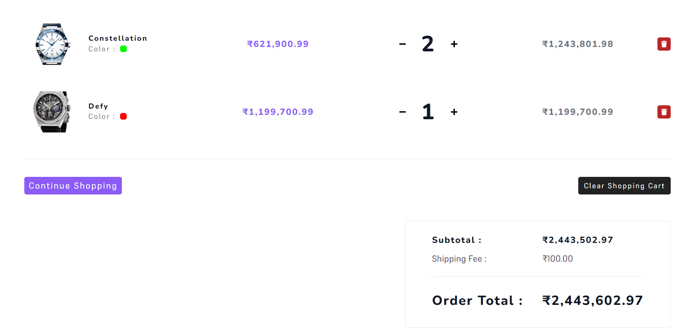
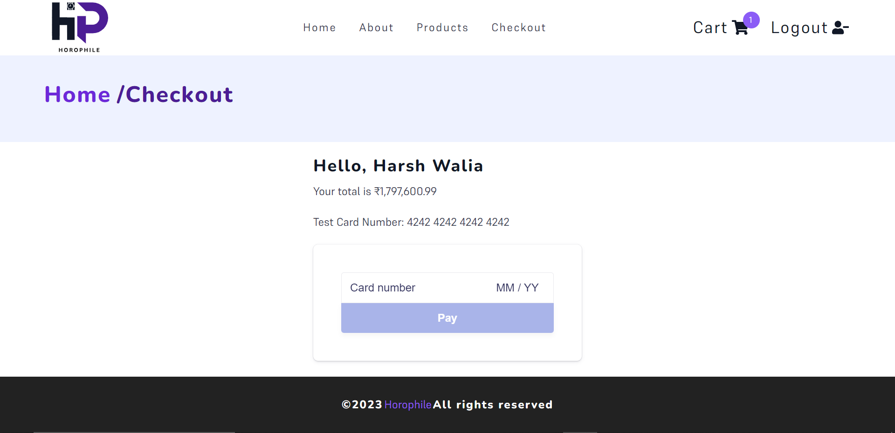

# HoroPhile


E-commerce website for `Watches`

<p align="center">
<a href="https://unite-apurva.herokuapp.com/landing">

</a>
</p>

## Features and Interfaces

1. Landing Page and Login Form

   - Seamless Login page with `Login with Google and Github` button for user Login using Auth0) Authentication
   - 

   - Landing Page for Horophile
   - 


   - About Page for Horophile
   - 


   - Products Page for Horophile
   - 


   - Single product Page for Horophile
   - 


   - Cart Page for Horophile
   - 


   - Checkout Page for Horophile
   - 


# Getting Started with Project


## - for login use Auth0

## - for payment checkout use Stripe

#### . change env vars

- REACT_APP_AUTH_DOMAIN=
- REACT_APP_CLIENT_ID=
- REACT_APP_STRIPE_PUBLIC_KEY=
- REACT_APP_STRIPE_SECRET_KEY=


#### Pick Product Photos

- at least 4 product images
- at least 4 secondary images

#### Create Airtable Account

- setup base and table
- add products

#### API KEYS

- Navigate to Docs
- Get API_KEY and Base ID and Table Name
- add all to .env

```js
AIRTABLE_API_KEY=
AIRTABLE_BASE=
AIRTABLE_TABLE=
```


## Available Scripts

In the project directory, you can run:

### `npm start`

Runs the app in the development mode.\
Open [http://localhost:3000](http://localhost:3000) to view it in the browser.

The page will reload if you make edits.\
You will also see any lint errors in the console.

### `npm test`

Launches the test runner in the interactive watch mode.\
See the section about [running tests](https://facebook.github.io/create-react-app/docs/running-tests) for more information.

### `npm run build`

Builds the app for production to the `build` folder.\
It correctly bundles React in production mode and optimizes the build for the best performance.

The build is minified and the filenames include the hashes.\
Your app is ready to be deployed!


